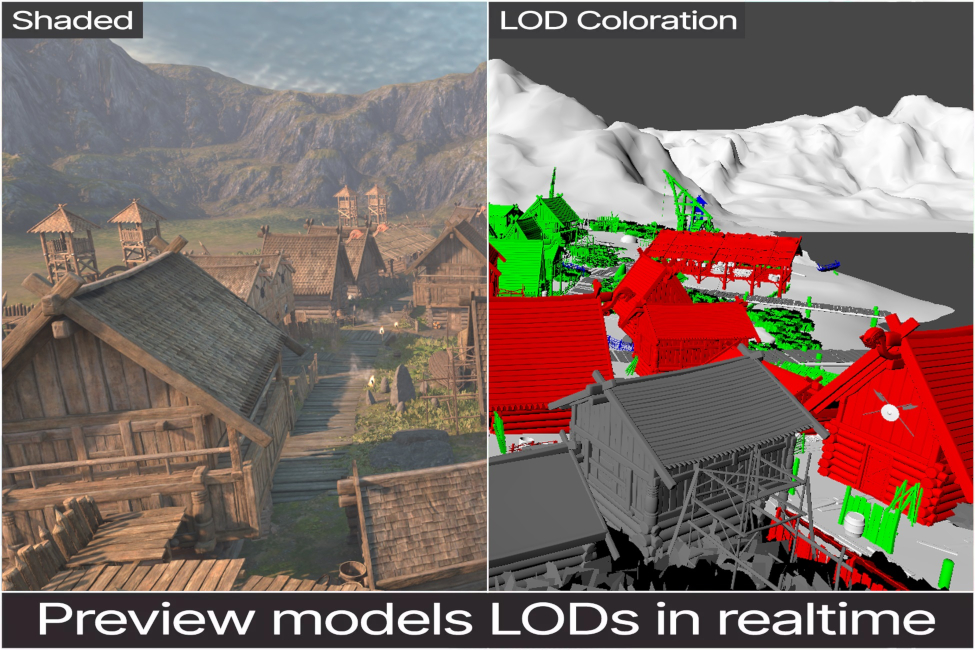
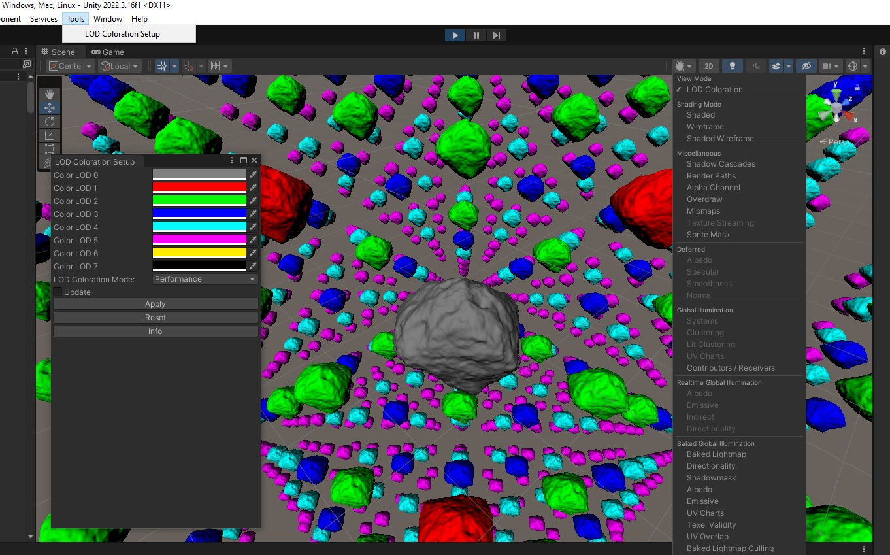

# Unity LOD Coloration

Author: Przemyslaw Zaworski
 
Licence: MIT https://mit-license.org/ (see License.md)

Content: 

* PluginSource (Visual Studio 2022, NET Standard 2.1). To compile LODColoration.dll, first set path to UnityEditor.dll and UnityEngine.dll in LODColoration.csproj.

* UnityProject (version 2022.3.16f1)

Usage:

* Enable LOD visualisation in Scene View control bar.

* Go to Tools -> LODColoration Setup, the press Apply button.

* For detailed usage read: UnityProject/Assets/LODColoration/LODColorationReadme.pdf

